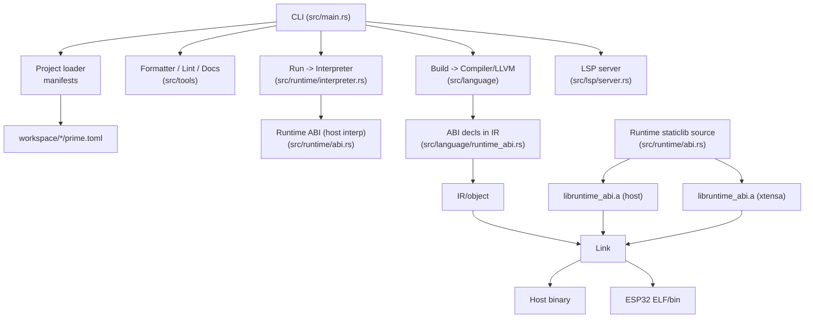
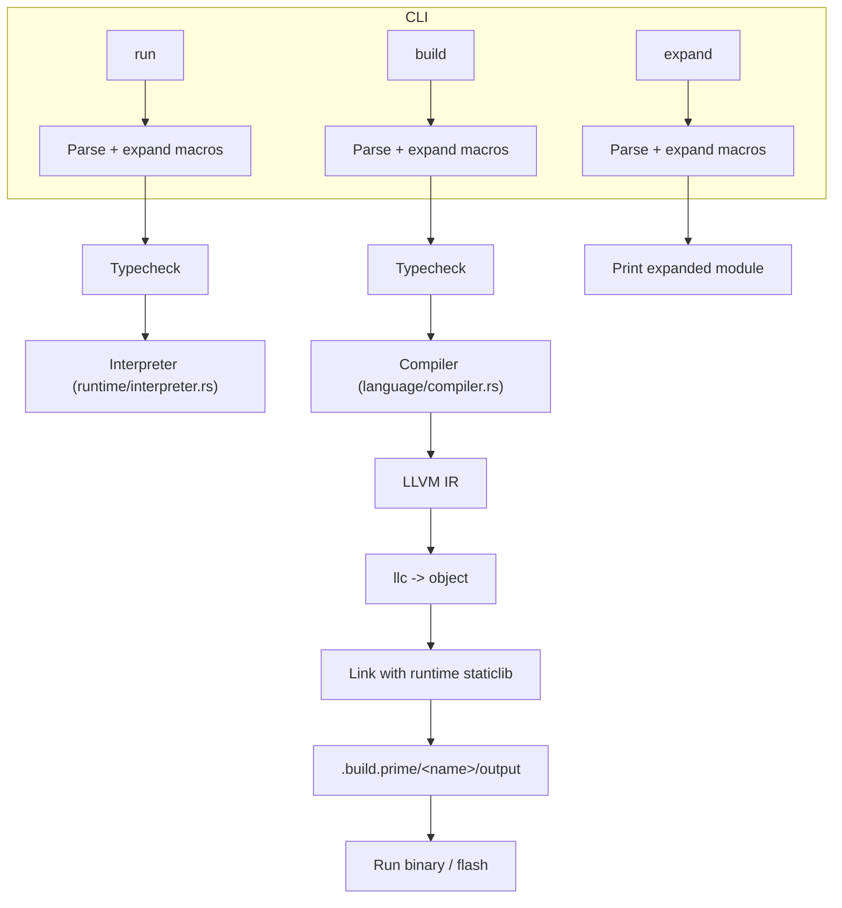
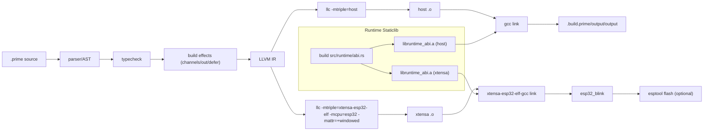
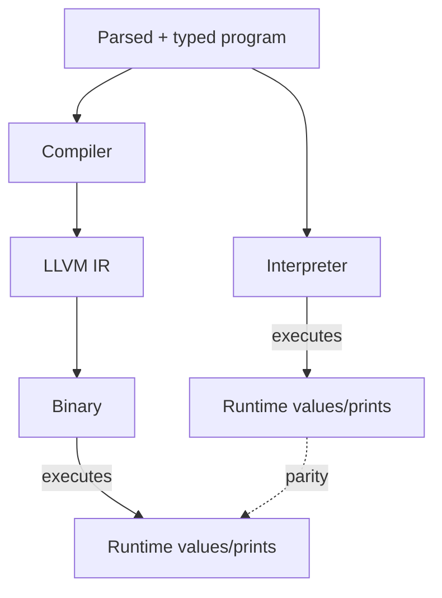
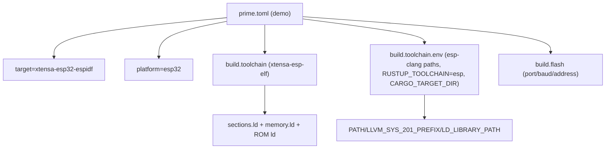

# Prime Architecture Guide

This guide gives maintainers a visual map of how the CLI, compiler, runtime, and embedded toolchain fit together. Diagrams use Mermaid so you can preview them directly in viewers that support it.

## Top-Level Components

## CLI Command Flow

## Build Pipeline (Host vs ESP32)

Notes:
- Host builds default to PIC; Xtensa builds force `-relocation-model=static` and pass
  `-mcpu=esp32 -mattr=+windowed -mtriple=xtensa-esp32-elf` to match the ESP toolchain.
- Linking the embedded binary pulls `libruntime_abi.a` (Xtensa) plus libc/libgcc; `esptool` uses `elf2image` when available, with objcopy as a fallback.

## Interpreter vs Build (Semantics Parity)

Both modes share the same AST/type system; build mode records effects (e.g., `out`, channels) and emits equivalent code. Concurrency (spawn/join/channel) is deterministic in build snapshots and mapped to OS threads in the emitted binary.
Async/await + channels always attach runtime handles when async code is present, so
`recv_task`/`sleep_task` block correctly in build mode, the host binary, and Xtensa.
Non-constant comparisons now lower to LLVM `icmp`/`fcmp` with SSA-backed booleans, keeping `if`/`while`/pattern conditions working even when values are only known at runtime.

## Embedded Runtime Highlights (src/runtime/abi.rs)

- `no_std` Xtensa runtime: entry (`call_user_start_cpu0`), BSS/data init, GPIO mux for common LED pins (2/4/5), calibrated delays for `sleep_task`, ROM printf bindings.
- `out(...)` plus channels and async tasks (`sleep_task`/`recv_task`) work in no_std; configurable static pools (`[build.runtime]` or `PRIME_RT_*`) back channels/tasks with a waiter queue + tiny poll for `recv_task`/`recv_timeout`.
- Tiny ring buffers for string storage to avoid print loss in tight loops.
- Watchdogs disabled once at boot for the demo (RTC + TIMG WDTs); remove if you need watchdog coverage.

## Manifest and Toolchain (workspace/demos/esp32_blink/prime.toml)

Defaults: if env vars are absent, the CLI auto-detects esp-clang/xtensa toolchains under `~/.espressif`, sets `RUSTUP_TOOLCHAIN=esp`, and caches artifacts in `~/.cache/prime-xtensa`.

## Memory Model & ABI Stability

- Channels are FIFO with at-most-once delivery; sends/recvs honor program order on host and embedded. Xtensa async waits wake within the poll interval (default 1–2ms), so plan for ~2–3ms latency when waiting on channels.
- Build snapshots preserve channel inboxes and join handles to keep build/run parity; non-determinism is limited to I/O or explicit parallel builds (`PRIME_BUILD_PARALLEL=1`).
- Runtime ABI symbols are shared between host and embedded binaries via `libruntime_abi.a`; the frozen Xtensa toolchain and linker recipe lives in `docs/esp32_toolchain_template.toml` (-relocation-model=static + libc/libgcc).

## Repo Pointers

- Compiler: `src/language/compiler.rs` (LLVM emission), `src/language/runtime_abi.rs` (decls), `src/language/typecheck.rs`
- Interpreter: `src/runtime/interpreter.rs`
- Embedded ABI: `src/runtime/abi.rs` (Xtensa `no_std`, GPIO, prints, watchdog handling)
- CLI/wrappers: `src/main.rs` (subcommands, runtime build/link), `src/project/*` (manifests)
- Docs: `src/docs/topics.rs` (CLI `prime-lang docs`)

Feel free to expand these diagrams as the architecture evolves.
