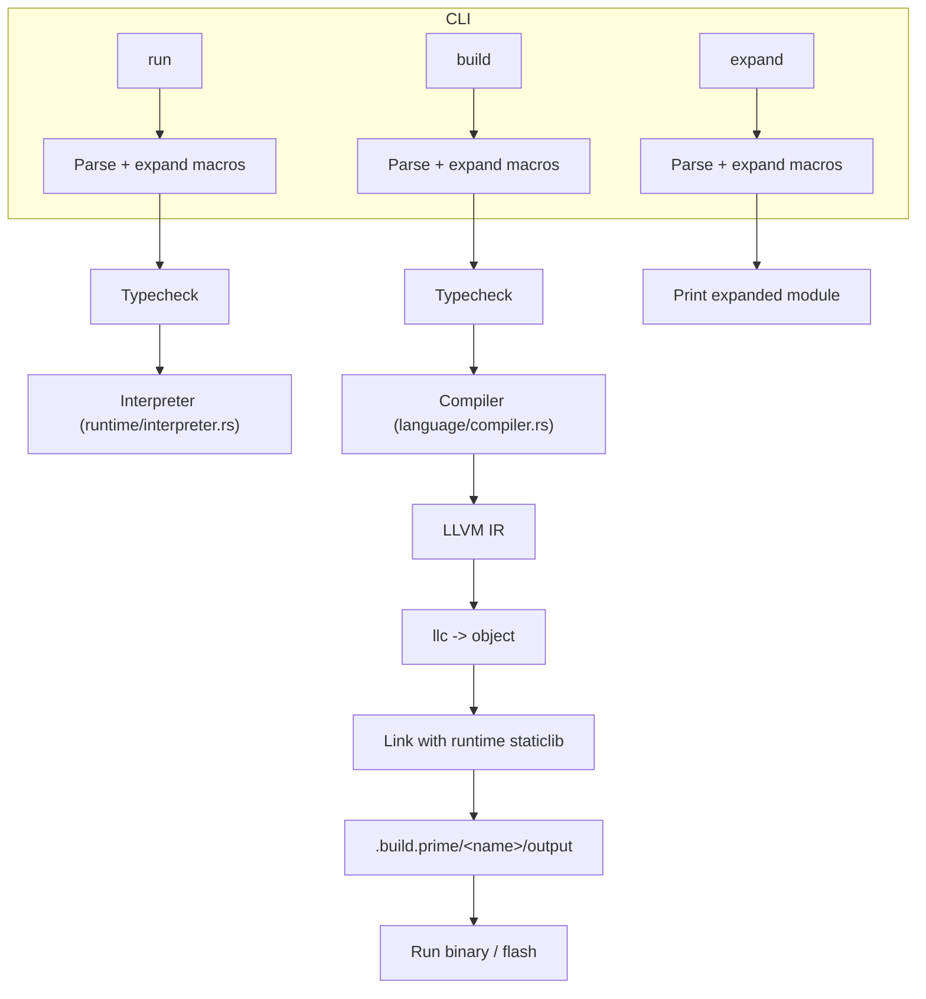
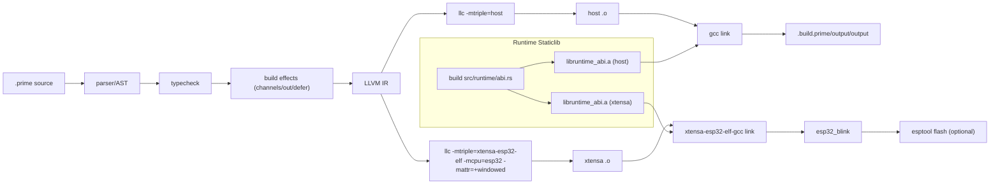
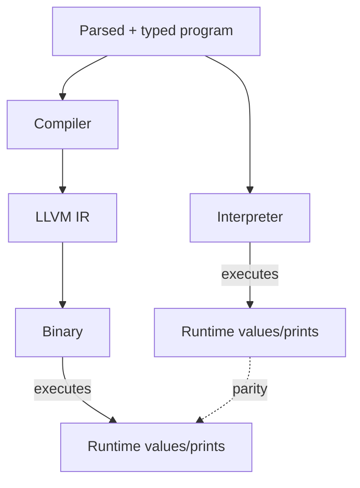
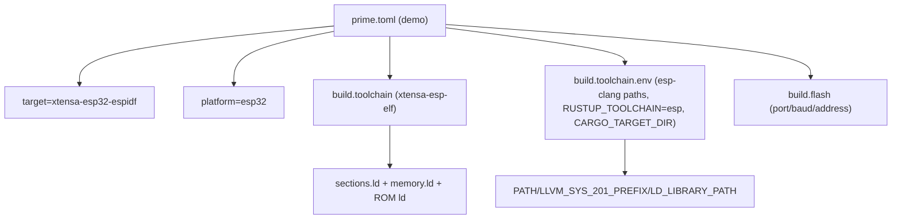

# Prime Architecture Guide

This guide gives maintainers a visual map of how the CLI, compiler, runtime, and embedded toolchain fit together. Diagrams use Mermaid so you can preview them directly in viewers that support it.

## Top-Level Components

```mermaid
graph TD
  A["CLI (src/main.rs)"] -->|Commands| B["Project Loader<br/>Manifest handling"]
  A -->|Subcommands| C["Formatter/Lint/Docs<br/>(src/tools)"]
  A -->|Run| D["Interpreter<br/>(src/runtime/interpreter.rs)"]
  A -->|Build| E["Compiler & LLVM<br/>(src/language)"]
  E -->|ABI Decls| F["Runtime ABI<br/>(src/language/runtime_abi.rs)"]
  E -->|IR-&gt;obj| G[LLC]
  G -->|Link| H["Binary/ELF + runtime lib"]
  H -->|Flash (optional)| I["ESP32 Device"]
  B -->|Manifests| J["workspace/*/prime.toml"]
  D -->|Builtin FFI| K["Runtime ABI<br/>(src/runtime/abi.rs)"]
```

## CLI Command Flow



## Build Pipeline (Host vs ESP32)



## Interpreter vs Build (Semantics Parity)



Both modes share the same AST/type system; build mode records effects (e.g., `out`, channels) and emits equivalent code. Concurrency (spawn/join/channel) is deterministic in build snapshots and mapped to OS threads in the emitted binary.

## Embedded Runtime Highlights (src/runtime/abi.rs)

- `no_std` Xtensa stubs: entry (`call_user_start_cpu0`), BSS/data init, GPIO2 setup, ROM delay/printf bindings.
- `out(...)` support: strings, format strings, ints (constants), bools; each call newline-terminated.
- Tiny ring buffers for string storage to avoid print loss in tight loops.
- Watchdogs disabled once at boot for the demo (RTC + TIMG WDTs); remove if you need watchdog coverage.

## Manifest and Toolchain (workspace/demos/esp32_blink/prime.toml)



Defaults: if env vars are absent, the CLI auto-detects esp-clang/xtensa toolchains under `~/.espressif`, sets `RUSTUP_TOOLCHAIN=esp`, and caches artifacts in `~/.cache/prime-xtensa`.

## Repo Pointers

- Compiler: `src/language/compiler.rs` (LLVM emission), `src/language/runtime_abi.rs` (decls), `src/language/typecheck.rs`
- Interpreter: `src/runtime/interpreter.rs`
- Embedded ABI: `src/runtime/abi.rs` (Xtensa `no_std`, GPIO, prints, watchdog handling)
- CLI/wrappers: `src/main.rs` (subcommands, runtime build/link), `src/project/*` (manifests)
- Docs: `src/docs/topics.rs` (CLI `prime-lang docs`)

Feel free to expand these diagrams as the architecture evolves.
