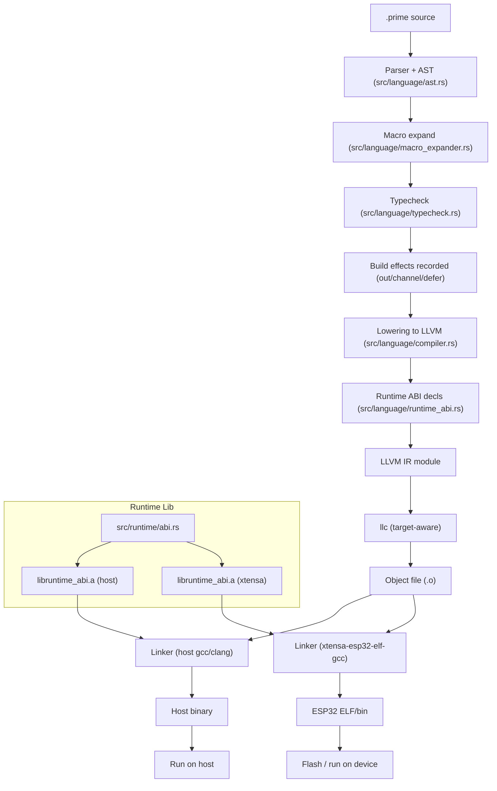

# Prime Compiler Flow (Detailed)

This diagram traces a build from parsed AST through LLVM IR to the linked binary, highlighting where type info, effects, and ABI calls are applied.

Key notes:
- The compiler reuses type info and build effects so `out(...)`, channels, and defers behave the same in build snapshots and the emitted binary.
- ABI declarations are inserted per module; the linked staticlib provides the concrete implementations (host or Xtensa).
- Target selection: host builds use the host triple; ESP32 uses `xtensa-esp32-elf` with `+windowed` attr and `-relocation-model=static` so llc stays compatible with the Xtensa toolchain.
- Async/await + channels always attach runtime handles when async appears, so `recv_task`/`sleep_task` block through the runtime ABI in build mode and in emitted binaries (host/ESP32).
- Scalar comparisons are lowered even when operands are non-constant: ints/floats emit `icmp`/`fcmp` and produce SSA-backed `BoolValue`s so control flow remains valid in build mode while still folding constants where possible.
