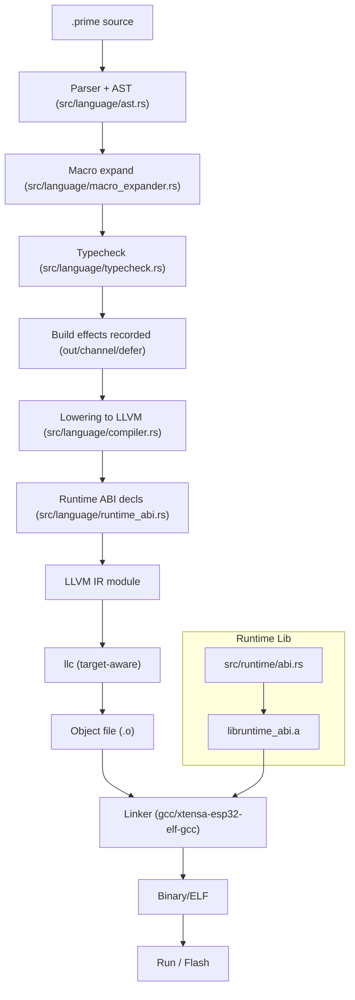

# Prime Compiler Flow (Detailed)

This diagram traces a build from parsed AST through LLVM IR to the linked binary, highlighting where type info, effects, and ABI calls are applied.

Key notes:
- The compiler reuses type info and build effects so `out(...)`, channels, and defers behave the same in build snapshots and the emitted binary.
- ABI declarations are inserted per module; the linked staticlib provides the concrete implementations (host or Xtensa).
- Target selection: host builds use the host triple; ESP32 uses `xtensa-esp32-elf` with `+windowed` attr.
