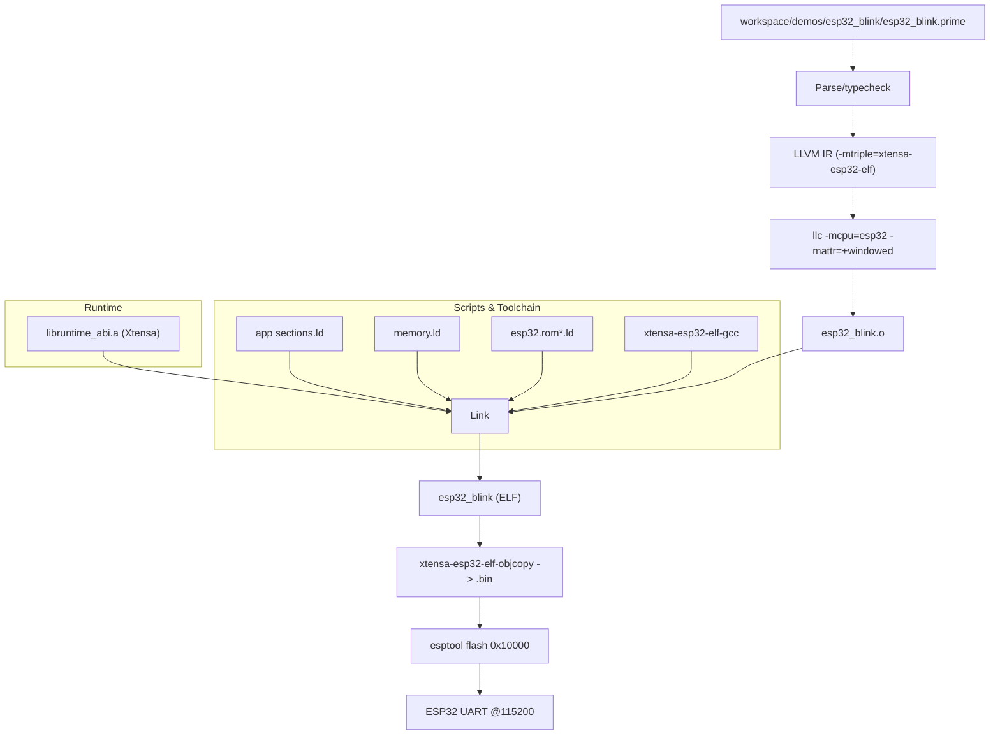

# Embedded Build & Flash Pipeline

End-to-end view for the ESP32 blink demo, including toolchains, scripts, and flashing.

Notes:
- Manifest supplies toolchain/env and linker scripts; defaults fall back to `~/.espressif`.
- Build uses `-relocation-model=static` for llc plus `-mcpu=esp32 -mattr=+windowed`; linking pulls `libruntime_abi.a` (Xtensa) plus libc/libgcc.
- Flashing prefers `esptool elf2image` to produce headers; falls back to objcopy when elf2image is unavailable.
- Runtime disables watchdogs once, uses ring-buffered prints, and drives `recv_task`/`recv_timeout` with a tiny waiter queue + poll (configurable via `[build.runtime]` or `PRIME_RT_*`). The default poll is 1–2ms; expect ~2–3ms wake latency on Xtensa.
- Default LED strap uses GPIO2 (active-low on many dev boards); override pin/level in the demo if your board differs.
- `out(...)`, channels, async `sleep_task`/`recv_task`, `prime_reference_read`, and GPIO built-ins are supported in no_std for ESP32.

## Parity Checklist (run/build/embedded)

- Control flow, pattern matching, generics/interfaces, macros, Option/Result + `try {}`/`?`, Drop + `defer`, mutable scalars (stack slots for ints/bools), and SSA-backed comparisons match across interpreter, host build, and Xtensa no_std. Runtime-backed `Result` payloads unwrap correctly inside async blocks with `?`.
- Concurrency: channels + spawn/join behave the same in run/build; embedded uses the async/task runtime (spawn maps to tasks, not OS threads). Async/await (`sleep_task`/`recv_task`) works on Xtensa with the waiter queue + poll noted above, and `spawn`/`join` parity is supported in embedded.
- I/O: `out` is available everywhere; filesystem built-ins (`fs_exists`/`fs_read`/`fs_write`) are host-only. `delay_ms`/`now_ms` are bridged to ROM stubs on Xtensa; host uses std timers.
- Platform hooks: `pin_mode`/`digital_write` are embedded-only. If you call them on host, the platform shim reports an error.
- Manifests: set `no_std = true` on embedded modules (see `workspace/demos/esp32_blink/prime.toml` and `workspace/demos/bare_metal_embedded/prime.toml`). Provide toolchain/env overrides or rely on CLI autodetect under `~/.espressif`.
- No_std parity fixture: `workspace/demos/bare_metal_embedded/main.prime` mirrors host concurrency with channels + async `recv_task` + `Result`/`?` so build/run/embedded outputs align.
