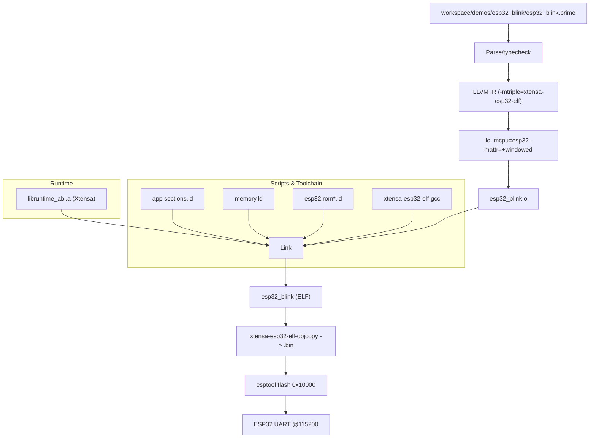

# Embedded Build & Flash Pipeline

End-to-end view for the ESP32 blink demo, including toolchains, scripts, and flashing.

Notes:
- Manifest supplies toolchain/env and linker scripts; defaults fall back to `~/.espressif`.
- Runtime disables watchdogs once, uses a calibrated busy-loop delay for sleep, and ring-buffered prints.
- `out(...)`, channels, async `sleep_task`/`recv_task`, and GPIO built-ins are supported in no_std for ESP32.
