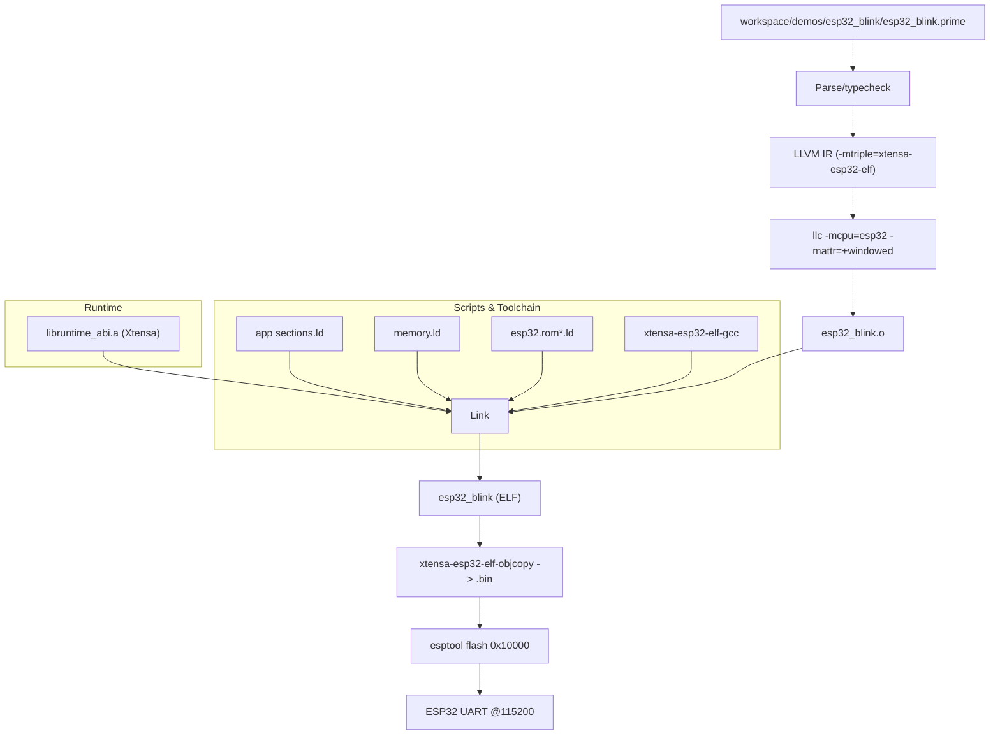

# Embedded Build & Flash Pipeline

End-to-end view for the ESP32 blink demo, including toolchains, scripts, and flashing.

Notes:
- Manifest supplies toolchain/env and linker scripts; defaults fall back to `~/.espressif`.
- Build uses `-relocation-model=static` for llc plus `-mcpu=esp32 -mattr=+windowed`; linking pulls `libruntime_abi.a` (Xtensa) plus libc/libgcc.
- Flashing prefers `esptool elf2image` to produce headers; falls back to objcopy when elf2image is unavailable.
- Runtime disables watchdogs once, uses ring-buffered prints, and drives `recv_task`/`recv_timeout` with a tiny waiter queue + poll (configurable via `[build.runtime]` or `PRIME_RT_*`). The default poll is 1–2ms; expect ~2–3ms wake latency on Xtensa.
- Default LED strap uses GPIO2 (active-low on many dev boards); override pin/level in the demo if your board differs.
- `out(...)`, channels, async `sleep_task`/`recv_task`, `prime_reference_read`, and GPIO built-ins are supported in no_std for ESP32.
