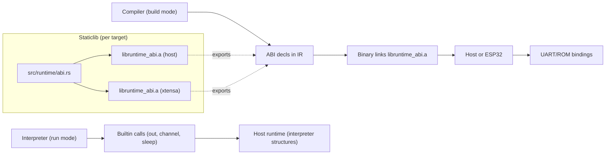

# Runtime & FFI Surfaces

How the interpreter, compiler, and runtime ABI interact across host and Xtensa targets.

Highlights:
- Interpreter uses its own in-process runtime; build mode invokes the ABI for async/channels when async appears (runtime handles are auto-attached).
- The same ABI signatures are declared in IR; linking picks the correct staticlib for the target. Xtensa builds request `-relocation-model=static` and link libc/libgcc alongside `libruntime_abi.a`.
- Xtensa runtime (no_std) includes async tasks, channels, calibrated delays (busy loop), GPIO mux for common LED pins, ring-buffered strings, watchdog disable, and basic reference helpers (`prime_reference_read` passthrough).
