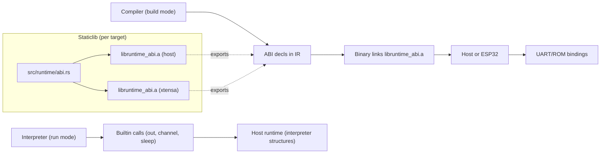

# Runtime & FFI Surfaces

How the interpreter, compiler, and runtime ABI interact across host and Xtensa targets.

Highlights:
- Interpreter uses its own in-process runtime; build mode only needs ABI shims plus values.
- The same ABI signatures are declared in IR; linking picks the correct staticlib for the target.
- Xtensa runtime uses ROM `ets_delay_us`/`ets_printf`, GPIO2 toggles, ring-buffered strings, and disables watchdogs once for the demo.
